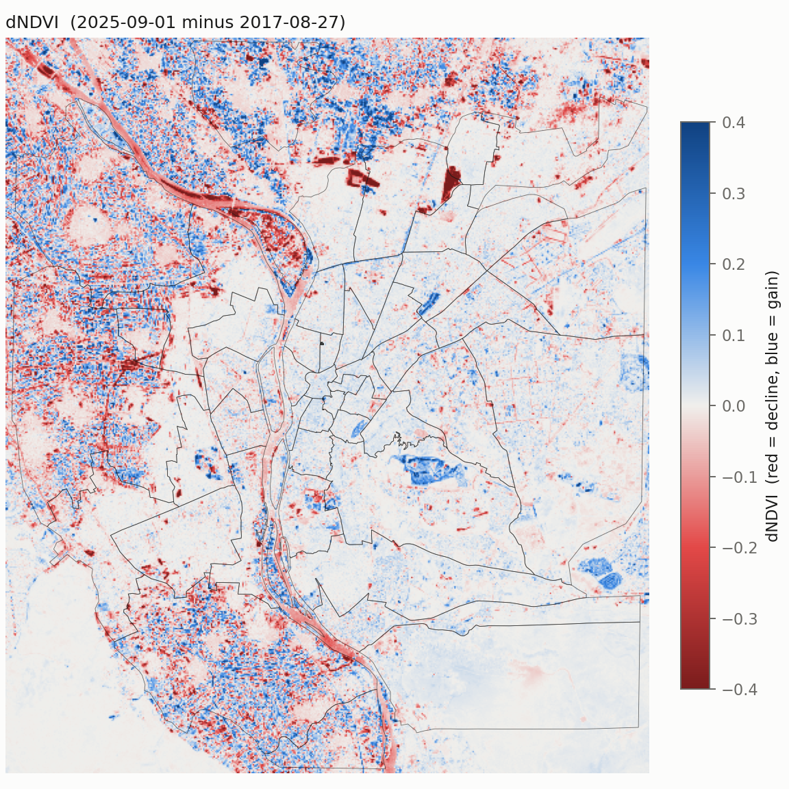

# Where did Cairo's green go?

**District-level NDVI change in Greater Cairo, 2017–2025, analysed end to end with the
[s3geo smart spatial system](https://pypi.org/project/smart-spatial-system/)
(`smart-spatial-system==0.5.7`).**

📄 **Paper:** [`paper/paper.md`](paper/paper.md) · 📊 **Data table:**
[`paper/district_change_table.csv`](paper/district_change_table.csv) · 🐞 **s3geo bug reports:**
[`bugs/`](bugs/)



## Key findings

- **Average greenness did not change, but vegetation extent did.** Between 27 Aug 2017 and
  1 Sep 2025, mean NDVI over the area stayed at 0.182. The area with NDVI ≥ 0.2 shrank by
  **≈ 2,000 ha (−6.6 %)**, most of it in the moderate-vegetation class (−14 %).
- **Losses sit on the peri-urban farmland fringe.** Of the 48 districts (qism/markaz), the
  sharpest declines are Waraq (−0.028 mean ΔNDVI; vegetated share 46.6 % → 37.5 %),
  Shubra al-Khayma 2, Kardasa, Al-Ahram, Khsos, Shubra al-Khayma 1 and Marg.
- **The historic core greened slightly** (+0.01 to +0.025).
- **The ranking is robust.** It holds with water masked and with an alternative metric
  (change in vegetated share).

## How s3geo was used

Every analytical step is an s3geo plugin call:

| Step | Plugin |
|---|---|
| NDVI | `ndvi_calculator` |
| ΔNDVI and masks | `band_math` |
| Vegetation and change classes | `raster_reclassify` |
| Per-district statistics | `zonal_statistics` |
| Change table | `raster_to_vector` → `centroid_extractor` → `spatial_join` → `attribute_statistics` |

numpy and rasterio are used only for I/O, regridding and plotting. The results were checked
against an independent numpy/rasterio re-computation and agree to **5 × 10⁻⁵**.

The case study also acted as a field test of s3geo. It found **8 defects in 0.5.6**, each with a
minimal reproduction (`scripts/verify_bugs.py`). **7 are fixed in 0.5.7.** Re-running on 0.5.7
reproduces every number exactly, and runs **~20× faster** (18.5 min → 55 s).

## Reproduce

```bash
pip install -r requirements.txt
python scripts/01_fetch_sentinel2.py                      # Earth Search STAC → clipped B04/B08
python scripts/02_fetch_districts.py --inspect            # documents that OSM has no qism level
python scripts/02_fetch_districts.py --source geoboundaries
python scripts/03_prepare_inputs.py                       # reflectance, 60 m UTM 36N grid
python scripts/04_run_s3geo_pipeline.py                   # all s3geo plugin steps
python scripts/04b_sensitivity_land_only.py               # water-masked sensitivity
python scripts/05_figures_tables.py
python scripts/06_crosscheck.py                           # independent verification
python scripts/verify_bugs.py                             # s3geo bug reproductions (PASS = fixed)
```

No login or API key is needed. All inputs are public, and their provenance is listed in
[`data/README.md`](data/README.md).

## Repository layout

| Path | Contents |
|---|---|
| `paper/` | paper, research plan, figures, result tables |
| `scripts/` | numbered, idempotent pipeline |
| `bugs/` | one report per s3geo defect, plus the upstream fix prompt |
| `data/README.md` | data sources, scene IDs, selection rules, licences |
| `CLAUDE.md` | project rules (s3geo is never edited, only used) |

## Data and licences

- **Code:** MIT. **Paper, figures and tables:** CC BY 4.0. See [`LICENSE`](LICENSE).
- **Imagery:** Copernicus Sentinel data 2017, 2025 (ESA), via AWS Open Data / Element 84 Earth
  Search.
- **District boundaries:** geoBoundaries gbOpen EGY ADM2 (CAPMAS / OCHA ROMENA), CC BY 3.0 IGO.

## Cite

See [`CITATION.cff`](CITATION.cff), or use GitHub's “Cite this repository” button.
