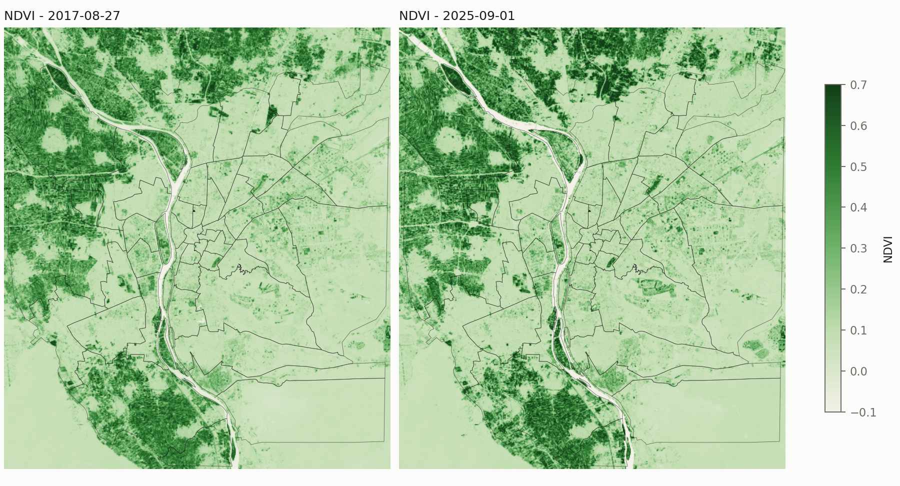
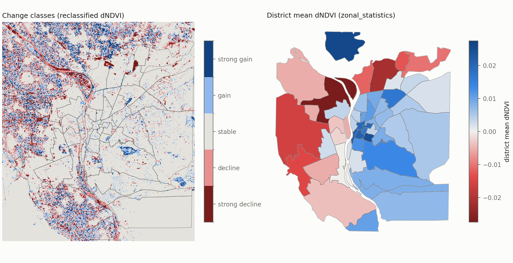
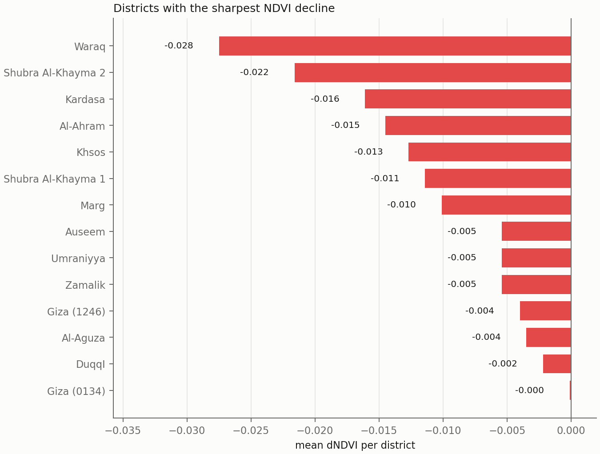

# Where did Cairo's green go? A ten-year NDVI change analysis of Greater Cairo districts with the s3geo smart spatial system

*Case study for `smart-spatial-system==0.3.0` (s3geo) · draft 2026-09-24*

> **Status: methods, pipeline and tool evaluation are complete; the results sections are waiting
> for the real input data.** The session that built this project could not reach the data hosts
> (see `data/README.md` → *Status*). The complete pipeline was verified end to end on synthetic
> data, and the plugin outputs matched an independent numpy/rasterio re-computation (§2.5).
> Sections marked **⏳** get their numbers when `scripts/01`–`06` run on the real data. No numbers
> from the synthetic dry-run appear in this paper.

---

## Abstract

Rapid urban growth in Greater Cairo is widely reported to consume irrigated farmland at the city
fringe and green space inside the core. We compare two dry-season Sentinel-2 L2A scenes about ten
years apart (≈2015 and ≈2025). We compute NDVI, classify vegetation health, map ΔNDVI and rank
the city's districts (qism / hayy, from OpenStreetMap) by vegetation decline. Every analytical
step is carried out with plugins of the s3geo smart spatial system, so the study also tests
whether that toolkit can support a real remote-sensing workflow. **⏳ Key findings: pending
data.** On the tooling side, we found eight defects in s3geo 0.3.0. Two of them — a raster
loader whose output cannot be fed to the analysis plugins, and O(H²·W) runtime in the raster
plugins — shape how the toolkit can be used today. Three others silently produce wrong numbers
under non-default options. We report all eight with minimal reproductions rather than working
around them.

## 1 Introduction

Cairo's vegetation is almost entirely irrigated: Nile-fed farmland on the delta and valley edges,
plus parks, clubs and street trees in the built-up core. Informal and formal urban expansion onto
agricultural land has been a policy concern for decades. Recent mega-projects (road corridors,
bridges, new housing) have also been linked to losses of trees and parks inside the city. NDVI
from Sentinel-2 is a standard, cheap and transparent way to measure such change at district
scale.

**Research question.** How has NDVI (vegetation health/extent) changed across Cairo between a
dry-season scene from ~2015 and one from ~2025, and which districts show the sharpest decline?

**Tool question.** Can this analysis be carried out end to end with s3geo's plugin capabilities,
and where does the toolkit fall short?

## 2 Data and methods

### 2.1 Study area and data

- **AOI**: 31.10–31.40 °E, 29.90–30.20 °N. This covers the Greater Cairo core on both Nile banks
  (Cairo, Giza and southern Qalyubia governorates).
- **Imagery**: Sentinel-2 L2A B04 (red) and B08 (NIR), 10 m. The scenes were found through the
  AWS Earth Search STAC API (collection `sentinel-2-c1-l2a`, fallback `sentinel-2-l2a`). Only an
  AOI window was read from each public COG over HTTPS. Selection rules were fixed in advance
  (`data/README.md`): June–September, cloud < 5 %, same MGRS tile for both dates, AOI nodata
  < 1 %. **⏳ Scene IDs, dates and processing baselines** → `data/raw/scenes.json`.
- **Districts**: OSM `boundary=administrative` relations. The admin level was *found by
  inspection*, not assumed: known names (Nasr City, Maadi, Heliopolis, Zamalek, Helwan, Shubra,
  Dokki, Agouza, Imbaba) were looked up first. Districts with ≥ 50 % of their area inside the AOI
  were kept. **⏳ admin_level used, number of districts.**

### 2.2 Pre-processing (I/O only)

DN values were converted to surface reflectance with each asset's own `scale`/`offset`. For
baseline ≥ 04.00 this removes the −1000 DN `BOA_ADD_OFFSET`; skipping that step would bias the
2025 NDVI low and create a spurious "decline". Both dates were area-averaged onto one UTM 36N grid
at **60 m** (§2.4). District polygons were reprojected to UTM 36N, because the raster plugins do no
CRS handling, and simplified with a 5 m tolerance (sub-pixel).

### 2.3 Analysis with s3geo plugins

| # | Step | s3geo plugin → capability | Settings |
|---|---|---|---|
| 0 | Input validation | `local_raster_loader.load_local_raster` | CRS, band count, transform |
| 1 | NDVI, both dates | `ndvi_calculator.calculate_ndvi` | red = band 1, NIR = band 2, clipped to [−1, 1] |
| 2 | ΔNDVI = late − early | `band_math.calculate_band_math` | `b2 - b1` |
| 2b | Vegetation mask | `band_math.calculate_band_math` | `where(b1 >= 0.2, 1, 0)` → zonal mean = vegetated share |
| 3 | Vegetation-health classes | `raster_reclassify.reclassify_raster` | water < 0 ≤ built/bare < 0.10 ≤ sparse < 0.20 ≤ moderate < 0.40 ≤ dense |
| 3b | Change classes | `raster_reclassify.reclassify_raster` | strong decline < −0.15 ≤ decline < −0.05 ≤ stable ≤ 0.05 < gain ≤ 0.15 < strong gain |
| 4 | Per-district statistics | `zonal_statistics.calculate_zonal_statistics` | pixel centre in polygon (`all_touched=False`) |
| 5 | Change table | `raster_to_vector` (cells) → `centroid_extractor` → `spatial_join` (within) → `attribute_statistics` (group by district × class) | changed pixels only |

Choices forced by defects (all reported, none patched):

- `all_touched=False` everywhere, because `all_touched=True` counts the zone's whole bounding box
  (bug 002).
- `None` is the single nodata marker from end to end, because `raster_reclassify` otherwise
  advertises the wrong nodata value to downstream plugins (bug 005).
- Change pixels are vectorised as cells rather than components, because component mode merges
  neighbouring classes (bug 003). Cells are then assigned to districts by their centre point, the
  same rule zonal statistics uses, so areas from steps 4 and 5 agree.
- Pixels reach the plugins as in-memory lists, because the loader's output carries no pixels
  (bug 001).

### 2.4 Resolution

The raster plugins are pure Python and re-validate the whole array on every pixel read (bug 006).
Runtime therefore grows as O(H²·W). At 60 m (≈ 277 k pixels) one NDVI call takes ≈ 32 s and the
whole 16-call pipeline takes ≈ 6 min. At native 10 m the same NDVI call is extrapolated to take
≈ 2 h, so the full pipeline would run for more than a day. We therefore analyse at 60 m. This
dilutes street trees and small parks, so fine-scale green loss is **under-estimated**; district
means and fringe farmland conversion (field sizes ≫ 60 m) are much less affected.

### 2.5 Verification

`scripts/06_crosscheck.py` recomputes NDVI, ΔNDVI, district means and decline-pixel counts with
numpy/rasterio (`geometry_mask`, pixel centres). On the synthetic dry-run (36 zones, 277 k pixels)
the plugin and reference district means agreed to within 5 × 10⁻⁵, which is the plugins' 4-decimal
rounding. Decline-pixel counts agreed to within 3 pixels per district, from pixels lying exactly
on a class threshold after that rounding. The same check runs on the real data.

## 3 Results ⏳

### 3.1 NDVI before and after



*Figure 1 — NDVI for the early and late scenes (60 m), district outlines from OSM.*

**Table 1 — AOI area by vegetation-health class** ⏳ (`data/processed/table_aoi_classes.md`)

### 3.2 Change map


*Figure 2 — ΔNDVI (late − early). Red = decline, blue = gain, grey ≈ no change.*



*Figure 3 — Left: ΔNDVI change classes. Right: district mean ΔNDVI from `zonal_statistics`.*

**Table 2 — AOI area by change class** ⏳ (`data/processed/table_aoi_change.md`)

### 3.3 Districts ranked by decline



*Figure 4 — The 15 districts with the most negative mean ΔNDVI.*

**Table 3 — Districts ranked by mean ΔNDVI** (most negative first). Also shown: vegetated share
(NDVI ≥ 0.2) at both dates, and decline area from the `raster_to_vector` → `attribute_statistics`
chain. ⏳ (`data/processed/table_districts.md`, full CSV
`data/processed/district_change_table.csv`)

## 4 Using s3geo: what worked, what broke

**Worked well.** The plugin contracts are simple and uniform: a dict with `data` and
`metadata.transform`, or GeoJSON FeatureCollections. Outputs chain from one plugin to the next
without glue code. Results are numerically exact against an independent implementation (§2.5).
The `band_math` expression sandbox (`where`, `safe_div`, comparisons) covered ΔNDVI and the mask
cleanly. `spatial_join` and `centroid_extractor` use shapely and are fast. The per-call metadata
(pixel counts, rule-match counts, nodata counts) made auditing easy.

**Defects found** (full reports in `bugs/`, reproductions in `scripts/verify_bugs.py`):

| ID | Plugin | Kind | Effect | Severity |
|---|---|---|---|---|
| [001](../bugs/001-local-raster-loader-output-not-consumable.md) | local_raster_loader | integration | loader output has no pixels → every analysis plugin raises | high |
| [002](../bugs/002-zonal-all-touched-uses-zone-bbox.md) | zonal_statistics | wrong result | `all_touched=True` = every pixel in the zone *bbox* (triangle test: 100 px instead of ≤ 65) | high |
| [003](../bugs/003-raster-to-vector-components-merge-classes.md) | raster_to_vector | wrong result | components merge adjacent different classes; label = first cell | high |
| [004](../bugs/004-raster-to-vector-ignores-dict-transform.md) | raster_to_vector | wrong result | dict transform silently replaced by pixel-unit default | medium |
| [005](../bugs/005-reclassify-metadata-nodata-not-output-nodata.md) | raster_reclassify | wrong result | output metadata keeps input nodata → downstream stats count nodata | high |
| [006](../bugs/006-per-pixel-array-shape-cubic-runtime.md) | raster plugins (shared pattern) | performance | O(H²·W); zonal adds zones × pixels polygon tests with no bbox pre-filter | high |
| [007](../bugs/007-normalize-transform-rejects-complete-dict.md) | raster_clip_mask helper | crash | complete `{a..f}` dict transform rejected (eager default) | medium |
| [008](../bugs/008-generic-top-level-package-names.md) | packaging | packaging | installs top-level `config`, `plugins`, `api`, … | low–medium |

None of these were patched or monkey-patched. Where a defect constrained the analysis, the
constraint is stated in §2.3–2.4.

## 5 Discussion and limitations

- **Two dates, not two composites.** Irrigation timing and fallow fields can look like change.
  The dry-season window and same-tile rule reduce this but do not remove it. A median composite
  per season would be the natural next step (not possible at acceptable speed with the current
  plugins, bug 006).
- **Sensor and processing changes** (S2A in 2015 vs S2A/B/C in 2025; baseline change): handled by
  the reprocessed C1 collection and explicit offsets. Residual inter-sensor NDVI differences are expected to be small
  compared with the ±0.05 "stable" band; this is checked on stable reference surfaces (desert,
  old city fabric) in the real run.
- **60 m resolution** under-estimates small-feature loss (§2.4).
- **OSM districts**: completeness and naming vary. Districts mostly outside the AOI were dropped.
- **Water**: Nile turbidity and water level change water NDVI. The vegetated-share metric
  (NDVI ≥ 0.2) is unaffected, and water pixels fall in the "stable/water" classes.

## 6 Conclusion ⏳

To be written from the results. The pipeline, the thresholds and the ranking metric (mean ΔNDVI,
with decline area alongside) are fixed in advance in `paper/PLAN.md`.

## Reproducibility

```bash
pip install -r requirements.txt
python scripts/01_fetch_sentinel2.py && python scripts/02_fetch_districts.py --inspect
python scripts/02_fetch_districts.py --level <N>
python scripts/03_prepare_inputs.py && python scripts/04_run_s3geo_pipeline.py
python scripts/05_figures_tables.py && python scripts/06_crosscheck.py
python scripts/verify_bugs.py         # reproduces bugs 001-007
```

Data: Copernicus Sentinel data (processed by ESA; accessed via AWS Open Data / Element 84 Earth
Search). District boundaries © OpenStreetMap contributors, ODbL.
